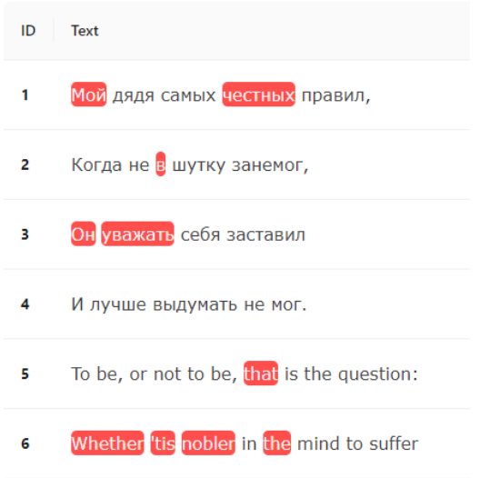

# Тестовое задание на стажера в Kaspersky

### Вы можете перейти по ссылке и посмотреть данное приложение [React Kaspersky](https://maxobodovskii.github.io/react-kaspersky/).

### Задание:

Инструментарий JS (желательно TS), React, MobX (по необходимости), Ant Design.

Написать приложение, выполняющее следующий функционал:

1. По нажатии кнопки «Load» открывается диалог выбора файла .csv.

   CSV файл содержит строки на русском и английском языке (тестовый файл для отладки
   можно создать самому, при проверке программе будет передан заранее сформированный
   файл от заказчика).
2. Файл распарсивается на отдельные строки и каждая строка отображается в таблице в отдельной строке.
3. Пользователь с помощью мышки при нажатии на слово может его выделить, а при повторном нажатии снять выделение

   
4. При нажатии кнопки «Save» в отдельный файл сохраняются выбранные слова (через разделитель “|”) для каждого предложения (если в предложении не выбрано никакого слова, то и в файл ничего для данной строки не записывается).

Приложение должно быть доступно по ссылке. 
